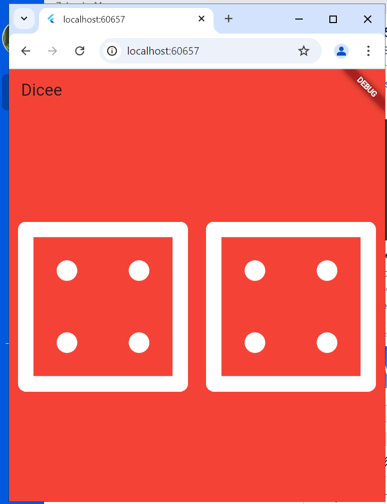

# Dice - Flutter Project

## Mô tả dự án
"Dice" là một ứng dụng trò chơi xúc xắc được phát triển bằng Flutter. Ứng dụng này giúp người dùng khám phá cách sử dụng các widget cơ bản trong Flutter và cách quản lý trạng thái. Khi người dùng nhấn nút, hai xúc xắc sẽ hiển thị các giá trị ngẫu nhiên.

---

## Nội dung tìm hiểu
- Sử dụng các widget cơ bản trong Flutter như `Scaffold`, `Row`, `Column`, `Image`, và `Button`.
- Quản lý trạng thái (`setState`) để làm mới giao diện khi có sự kiện xảy ra.
- Tạo kết quả ngẫu nhiên bằng thư viện `dart:math`.

---

## Chức năng chính
- Hiển thị hai xúc xắc với hình ảnh.
- Khi nhấn nút, kết quả của xúc xắc sẽ được làm mới và hiển thị ngẫu nhiên.

---

## Yêu cầu hệ thống
- **Flutter SDK** phiên bản mới nhất
- **Dart**
- **Visual Studio Code** hoặc **Android Studio** để phát triển ứng dụng.

---

## Cách sử dụng
1. Clone dự án từ GitHub hoặc sao chép vào máy của bạn.
2. Mở thư mục dự án bằng Visual Studio Code hoặc Android Studio.
3. Chạy lệnh dưới đây để tải các gói phụ thuộc:

   ```bash
   flutter pub get
   ```

4. Chạy ứng dụng trên thiết bị giả lập hoặc thiết bị thực:

   ```bash
   flutter run
   ```

---

## Ảnh minh họa
Dưới đây là hình ảnh demo của ứng dụng:



---

## Tài liệu tham khảo
- [Flutter Documentation](https://flutter.dev/docs)
- [Dart Documentation](https://dart.dev/guides)

---

## Tác giả
Ứng dụng được phát triển bởi [momo258momo].
